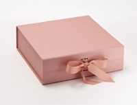

# Les 02: Materialen

Deze les vond ik persoonlijk zeer interessant. We kregen een mooi overzicht te zien, over de verscheidene stappen binnen een ontwerpproces, beginnend met een probleem tot het afgewerkt product klaar om in de rekken te leggen. Het was zeer duidelijk aangetoond welke opties we hadden in verband met machines in een Fablab en welke passende materialen we daarvoor nodig hebben. Later die les kregen we de opdracht verschillende prototypes te maken in papier. 

De eerste was het maken van een simpel cadeaudoosje. 

De tweede was het maken van een bankje, stevig genoeg, zodat die een stylo kon dragen. 
(foto) 

De derde was het namaken van een complexe stoel in origami, deze was jammer genoeg niet gelukt bij mij. 

