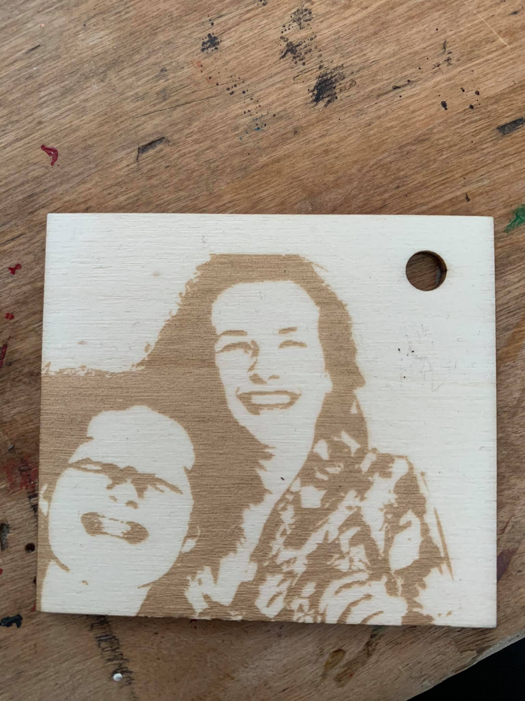
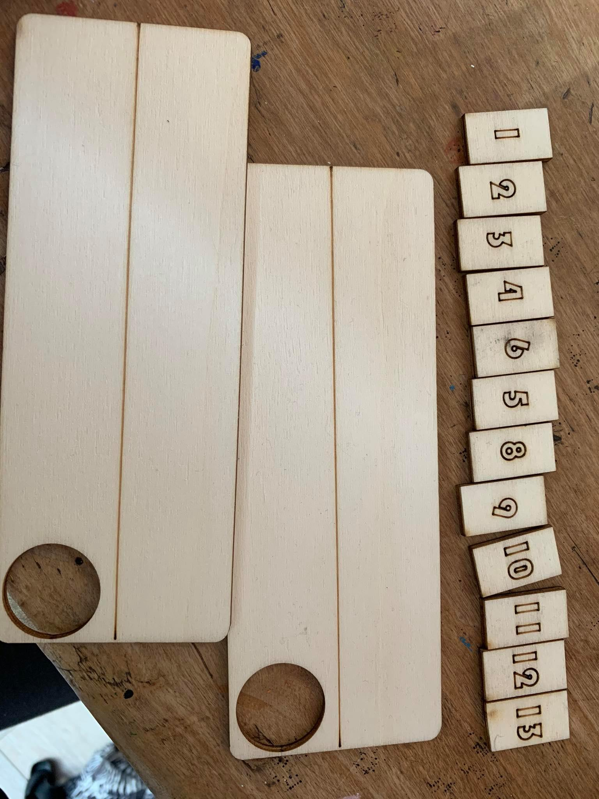

# Opdracht lasercutten en 2D tekenen 

Ik heb als eerste een foto proberen lasercutten als sleutelhanger. 

Vervolgens heb ik van het bekende gezelschap rummikub een reis versie gemaakt. 
Deze moet ik nog kleuren en magneetjes aan bevestigen zodat je het in de trein of auto kan spelen. 

(foto)